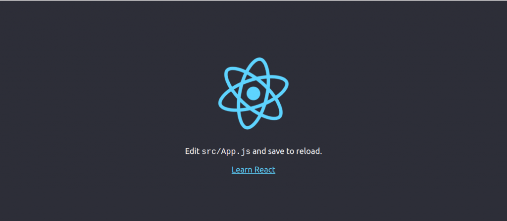
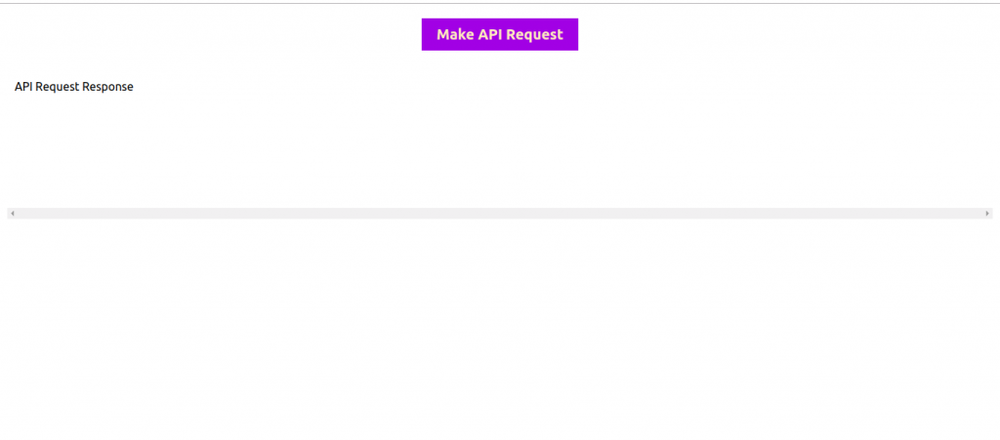

There has been a time when we might want to make a network request when a Redux action is dispatched. It gets a little interesting if we want to carry out actions if the request is successful and another if the request fails. While `redux-sage` and `thunk` make asynchronous actions easy to work with, there is an alternative and sure easy way to do the same and a little more.

## Basic React/Redux setup

To begin with, let's set up a basic React/Redux application. We will begin by installing `create-react-app`:

```bash
npm install create-react-app -g
```

Next, while in our directory of choice, create a project using `create-react-app`:

```bash
create-react-app easy-api-dispatch
```

We continue by changing directory in our directory of choice, then opening the created folder in our editor of choice. With VSCode on a Ubuntu 18.04 Linux machine, we can do:

```bash
cd easy-api-dispatch && code .
```

To verify our default installation, we can run npm start from the terminal.



#### UI Elements

We will have to clean up the `src/App.js` file for us to be able to render the elements that we will be using. I added

```javascript
<div className="App">
  <button>Make API Request</button>
  <div>API Request Response</div>
</div>
```

To make the `src/App.js` file looks like:

```javascript
import React from "react"
import "./App.css"

function App() {
  return (
    <div className="App">
      <button className="request-btn">Make API Request</button>
      <div className="response-container">API Request Response</div>
    </div>
  )
}

export default App
```

The button should look a bit fancier, we can add a little bit of CSS to oursrc/index.css file:

```css
.request-btn {
  background-color: blueviolet;
  color: bisque;
  border: 0px;
  padding: 10px 20px;
  margin: 20px;
  font-weight: 700;
  font-size: 20px;
  font-family: inherit;
}

.request-btn:hover {
  cursor: pointer;
}
```

Few styles won't be bad for our response-container too:

```css
.response-container {
  box-sizing: border-box;
  padding: 10px;
  margin: 10px;
  min-height: 200px;
  max-height: 500px;
  overflow-x: scroll;
  text-align: left;
}
```

We should have the same screen as below:



### Redux integration

Next, we install redux with npm:

```bash
npm install --save redux react-redux
```

We can then create `src/store/index.js` to bootstrap our redux store.

```javascript
import { createStore } from "redux"
import reducer from "./reducer"

const initialState = {}

const initializeStore = () => {
  createStore(reducer, initialState)
}
module.exports = initializeStore
```

And src/store/reducers/apiResponse.js with:

```javascript
import defaultState from "../defaultState"
import types from "../types"

const appStatus = (state = defaultState.apiResponse, action) => {
  switch (action.type) {
    case types.SET_RESPONSE_STATUS:
      return { ...state, status: action.payload }
    case types.SET_RESPONSE_DATA:
      return { ...state, data: action.payload }
    default:
      return state
  }
}

export default appStatus
```

Also, can update update `src/store/reducers/apiResponse.js` to look like:

```javascript
import defaultState from "../defaultState"
import types from "../types"

const appStatus = (state = defaultState.apiResponse, action) => {
  switch (action.type) {
    case types.SET_RESPONSE_STATUS:
      return { ...state, status: action.payload }
    case types.SET_RESPONSE_DATA:
      return { ...state, data: action.payload }
    default:
      return state
  }
}

export default appStatus
```

The intial and default state (at `src/store/defaultState.js`) should look like:

```javascript
const state = {
  apiResponse: {
    status: 0,
    data: {},
  },
  appStatus: {
    authenticated: false,
    makingRequest: false,
  },
}

export default state
```

While the `src/store/types.js` exports object with the redux types:

```javascript
export default {
  SET_APP_AUTHENTICATED: "SET_APP_AUTHENTICATED",
  SET_APP_MAKING_REQUEST: "SET_APP_MAKING_REQUEST",
  SET_RESPONSE_STATUS: "SET_RESPONSE_STATUS",
  SET_RESPONSE_DATA: "SET_RESPONSE_DATA",
}
```

The reducer should also be updated to implement combineReducers as we are now exporting our reducers in modules. The reducer should look like this:

```javascript
import { combineReducers } from "redux"
import appStatus from "./reducers/appStatus"
import apiResponse from "./reducers/apiResponse"

const reducer = combineReducers({ appStatus, apiResponse })

export default reducer
```

Part of my React/Redux structure is to have files that exports my redux actions. The functions could do any side effects and receive arbitrary arguments, what I mind is that they return a basic redux function ready for dispatch.

In this case, I have `src/store/actions` directory to house all of my actions.

### Installing redux-api-middleware

Traditionally, we can dispatch an async action which can be used to make network requests.

Packages like `redux-thunk`, `redux-saga` make this seamless. But they come with a perk of sending the actual request explicity by the developer.

In any case that we might need to save the data to redux store, we would have dispatch another action that will handle that. And this is a default behaviour of most GET requests sent from a client (web browser/mobile app). How about if we can do more with less?

Coming from `redux-thunk` documentation:

```js
function fetchSecretSauce() {
  return fetch("https://www.google.com/search?q=secret+sauce")
}

function makeASandwichWithSecretSauce(forPerson) {
  return function (dispatch) {
    return fetchSecretSauce().then(
      (sauce) => dispatch(makeASandwich(forPerson, sauce)),
      (error) => dispatch(apologize("The Sandwich Shop", forPerson, error))
    )
  }
}

const forPerson = {}
dispatch(makeASandwichWithSecretSauce(forPerson))
```

The above code is trying to `fetchSecretSauce` for a person based on a certain parameter, before actually making the Sandwich. While this is nice, it does not take away the fact that, it should be smart enough to know when an action should make network requests or not.

How about, if we just have a setup that tells about the URL and method we want to call, and the middleware actually handles the error and success action for us automatically?

We just tell it the actions that need to be dispatched, but under the hood, it makes network request, fetch data, then store to our redux store, is that not awesome enough?

Introducing `redux-api-middleware`, an `npm` package that eases API calls while dispatching a redux action.

### Store setup for redux-api-middleware

Firstly, let's do some store setup for this our honorable middleware.

### Network request with redux-api-middleware

After our setup, we can now issue network requests from using our actions.

### Verifying network request result

As seen in the result tab, we have been able to call the endpoint, store the data and not have to setup different actions for the events.

### Easy dispatch with redux-api-middleware-dispatcher

Taking it a little further and easier, let's install an npm package that dispatches `redux-api-middleware` actions while abstracting all the setup issues away from us.

```bash
npm install redux-api-middleware-dispatcher
```

To better see how to use this library(`redux-api-middleware-dispatcher`), check out its [documentation](https://www.npmjs.com/package/redux-api-middleware-broker#docs)

## Conclusion

The major advantage to use redux-api-middleware over the traditional async action is the single setup it provides, such that we don't have to keep calling dispatch each time a request is complete aside determining if it fails.

Life should be easy isn't it, making network requests with redux should be easier!
