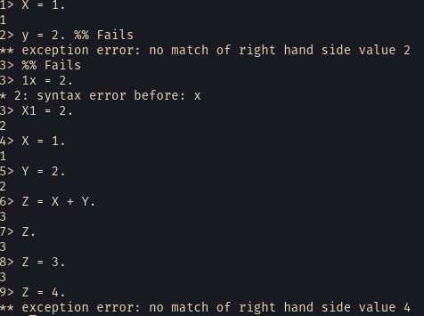

If you have worked with other languages like JavaScript, Java, Python etc, you would be surprised by what Erlang understands as variable. In Erlang, variables starts with uppercase letter, thus, `C`, `X`, `Ape`, `Ant` are all valid identifiers for Erlang variables. Variables can not start with lowercase letter and begin with a number, Erlang variables can include can alphanumeric characters, an underscore and @ symbol.

```erl
X = 1. %% Valid
y = 2. %% Invalid
1X = 2. %% Invalid
```

When _assigning_ to a variable - as we do call it in other languages, Erlang actually does something called pattern matching. Comparing the values on the right to the values on the left. A pattern match would only succeed if they two operands match, thus, in Erlang, a variable get assigned to if it is either `unbound` or has the same value as the value at the right.

The `=` is a special symbol that does not do assignment but makes the pattern matching operation to be successful if its conditions are met. Hence, in Erlang `=` is known as a pattern match operator which evaluates the value of the right hand side (RHS) then matching the result with the left hand side (LHS)

```erlang
X = 1. %% successful
Y = 2. %% successful
Z = X + 1. %% successful

Z. %% => 3

Z = 3 %% successful
Z = 4 %% fails
```

There is no thing as global or private scope in Erlang, all variables are lexically scoped and are unrelated even if they exists in different functions;



---

Continue to the next of Erlang Learning: [Erlang Pattern Matching](/blog/erlang-pattern-matching)