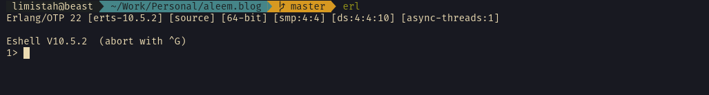

If you have used WhatsApp, Facebook Chat, then you have one way or the other interacted with an Erlang backed system.

Erlang is a language created for telecommunication industry by _Erlang Creator_ at _Erlang Creation Space_. It was recorded that Jor Armstrong claimed he was provided a library and did not know what to do with it, then they taught to solve the reliability and concurrent problem of the telecommunication industry, and that gave birth to Erlang.

The strength of Erlang lies in running scalable applications in a Distributed environment. It allows computers to network with each other with a very little overhead on the programmer and the operating system.

We are not here to battle why Erlang is the great concurrent programming language, we are here to envagalize about its syntax and way of thinking.

In this posts, we would be getting a formal introduction to Erlang and we are just covering the basics. We would be covering variables, funcs (functions), modules, types, records, maps, processes, and distributed system.

What we won't cover is the whole of the OTP framework. In the future, we would be having a post about this, for now, _let's learn some Erlang_!

## Installation and Initialization

For a thorough guide on how to install Erlang runtime on different platforms, checkout [Bruce Yinhe's post on medium](https://medium.com/@brucifi/erlang-quick-install-a3b7fd96947f) about this.

After a successful installation, open a terminal/CMD, and type in `erl`,
a default welcome message and prompt should be seen. Great, welcome to the Erlang world.

---

Now that we have covered the very basic installation, follow through the links below to learn more about Erlang and its syntax.

- [Variables](/blog/erlang-variables)
- [Pattern Matching](/blog/erlang-pattern-matching)
- [Funcs](/blog/erlang-functions)
- [Modules](/blog/erlang-modules)
- [Types](/blog/erlang-types)
- [Records](/blog/erlang-records)
- [Maps](/blog/erlang-maps)
- [Processes](/blog/erlang-processes)
- [Processes communication](/blog/erlang-processes-communication)
- [Distributed system](/blog/erlang-distributed-system)
