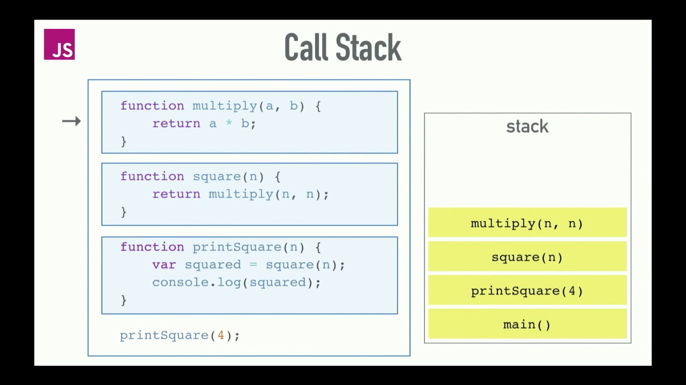

In computation systems, names like concurrent, sequential, parallel, serial, synchronous, asynchronous, non-blocking, shared state, message passing and likes, these names stand as a forbearer for the actual task that actually happens in a system.

While all of above techniques have their use cases, in the world of JavaScript, asynchronous and synchronous programming never leave the tongues of its programmers.

In his [__Concurrency glossary__](https://slikts.github.io/concurrency-glossary/?id=asynchronous-vs-synchronous-non-blocking-concurrent-vs-blocking-sequential), **Author** wrote about asynchronous, and said:

> Asynchrony means "not happening at the same time", and asynchronous message passing is a communication model that does not require the sending and receiving to be synchronized, meaning that the sender isn't blocked until the receiver is ready.

It might not be clear still, we will go into a later detail about this with a real life example. (_Don't tell anyone, life is mostly asynchronous_).

While languages like Java, C#, C++ etc runs their computation on the main thread, and could _spawn_ out a new thread to run another set of instructions which are in parallel to the main thread and could communicate with it, JavaScript in its uniquenes does not support that model of computation.

In JavaScript, all its computations and instructions are run in a [sequence](https://slikts.github.io/concurrency-glossary/?id=concurrent-order-independent-vs-sequential) (i.e one after another) in a single thread. This means that for instructions ranging from A, B, C, ... to E to be executed, A would be executed firstly and when done, B is then executed, then C, then D, then E which sees the program to its end.

Still, with the _single threaded_ nature of JavaScript, there is a unique feature that makes it outstanding, it is its **non blocking I/O model**. I/O(Input/Output) counld be in any form, like fetching of data over the internet, getting a file from the filesystem and likes, all of these processes does not block the main thread from continuing its execution.

### A real life case study

In high school, when we were given an assignment, we were required to submit them. Once we submit those assignment to the teacher, we are expected to wait to return them marked/graded.

While we have submitted those assignments and were waiting for the results, we could do other things like reading, attend classes, play games and joke with friends.

Once the teacher is done marking, he notifies us, and we would go to get them from him/her, and the process is completed.

In this scenario, we have done a task asynchronously. While the teacher could only do one thing at a time, we have asked him/her to teach us and still mark our assignments.

We knew that he could not complete both of them at the same time, so we would wait but, set a trigger (through the class rep/governor) that made us to know that the assignments are ready and the results are out.

The notification could help us to determine what next to do, either to proceed with putting our books into our bags or doing the corrections or learning from other classmates.

That is what we do in asynchronous programming.

### Asynchrony in JavaScript

While the languages comes with support for asynchronous programming, there was no inclusion of an official model to write an asynchronous program until programmers started inventing their own models. In the modern JavaScript engine, there is an added support for writing asynchronous codes. We would be exploring these options and their demerits, and we would conclude with why I think that Async/Await is a great feature to understand. Let's hit the engine start knob. 